# Sistema de Ayuda para Deployear el Sistema de Desarollo del TryIT

# Índice

1. [Descargar los sistemas](#1-descargar-los-sistemas)
2. [Configuración del fichero hosts](#2-configuración-del-fichero-hosts)
3. [Ejecutar Docker Compose del sistema de ayuda](#3-ejecutar-docker-compose-del-sistema-de-ayuda)
   1. [Arregla ruta relativa a ficheros estáticos del backend](#31-arregla-ruta-relativa-a-ficheros-estáticos-del-backend)
   2. [Ejecutar nginx](#32-ejecutar-nginx)
4. [Ejecutar el frontend](#4-ejecutar-el-frontend)
5. [Ejecutar el backend](#5-ejecutar-el-backend)
   1. [Arrancar Docker Compose del backend](#51-arrancar-docker-compose-del-backend)
   2. [Ejecutar scripts dentro del contenedor](#52-ejecutar-scripts-dentro-del-contenedor)
6. [Añade datos del SIU en el panel de administración](#6-añade-datos-del-siu-en-el-panel-de-administración)
7. [Añadir una edición con el año actual](#7-añadir-una-edición-con-el-año-actual)
8. [Listo](#8-listo)
9. [Pruebas](#9-pruebas)
    1. [Conexión backend frontend](#91-conexión-backend-frontend)
    2. [Login con SIU](#92-login-con-siu)
    3. [tryit.upm.es apunta a localhost](#93-tryitupmes-apunta-a-localhost)
    4. [tryit.upm.es o tryit.upm.es/admin o tryit.upm.es/api devuelven 502 Bad Gateway o un Unable to conect](#94-tryitupmes-o-tryitupmesadmin-o-tryitupmesapi-devuelven-502-bad-gateway-o-un-unable-to-conect)

<br>
<br>
### 9.4 tryit.upm.es o tryit.upm.es/admin o tryit.upm.es/api devuelven 502 Bad Gateway o un Unable to conect
---

<br>

> **Disclaimer inicial:**  
> Al acceder a la página en desarrollo hosteada localmente, aparecerá un aviso de que se están usando **certificados autofirmados (self-signed certificates)**. Esto es normal en entornos locales.  

<br>


|  | |
|:-:|:-:|
| 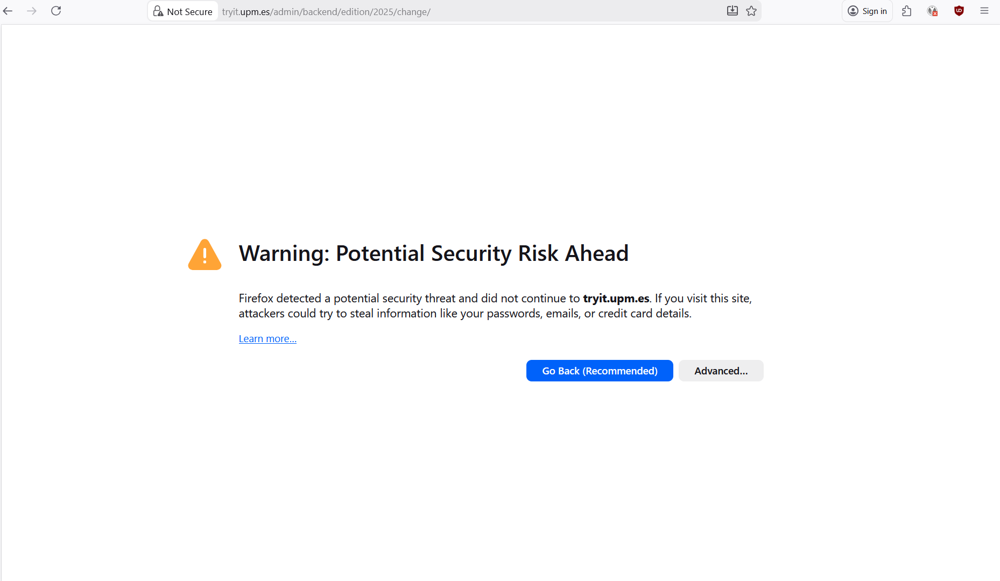 |  |


<br>

---

## 1. Descargar los sistemas

1. **Backend**  
   Clona la repo del backend:  
   ```bash
   git clone git@github.com:DA-ETSIINF/tryit-frontend.git
   ```
   > **Recuerda que necesitas tener acceso permitido a este repositorios**


2. **Frontend**

    Clona la repo del frontend:
    ```bash
    git clone git@github.com:DA-ETSIINF/tryit-backend.git
    ```
    > **Recuerda que necesitas tener acceso permitido a este repositorios**

3. **Sistema de ayuda (este sistema)**
    Clona la repo de este sistema:
    ```bash
    git clone <ENLACE_REPO_DE_AYUDA>
    ```
    >Este paso es opcional y no es necesario para el desarollo de la aplicación. Solo es necesario si no quieres conectar el frontend con el backend por tu cuenta y hacer que el SIU funcione en local por tu cuenta.

## 2. Configuración del fichero hosts

Para poder acceder al sistema usando el alias tryit.upm.es, hay que añadir la siguiente línea al fichero hosts:

```
127.0.0.1 tryit.upm.es
```

### Instrucciones según el sistema operativo:

<div style="margin-left: 1em;">

#### 1. **Linux / macOS:**

</div>
<div style="margin-left: 2em;">

Abre el fichero hosts del sistema:

```bash
sudo nano /etc/hosts
```

Añade la línea ```127.0.0.1 tryit.upm.es``` y guarda (Ctrl+O, Enter, Ctrl+X).
</div>

<div style="margin-left: 1em;">

#### 2. **Windows:**

</div>
<div style="margin-left: 2em;">

Abre Bloc de notas como **administrador**.

Abre el fichero ```C:\Windows\System32\drivers\etc\hosts```

Añade la línea ```127.0.0.1 tryit.upm.es``` y guarda.

> Si esta parte falla (tryit.upm.es no apunta a localhost) asegurate de que se haya guardado bien el fichero y que lo editaste con permisos de administrador

</div>

<br>

**Tras realizar este paso se recomienda realizar la prueba [Prueba 9.3: tryit.upm.es Apunta a Localhost](#93-tryitupmes-apunta-a-localhost), ya que si esto falla no va a funcionar el sistema.**

<br>

> Disclaimer: Para acceder a la página real de tryit.upm.es después de hacer este paso, hay que eliminar o comentar esta línea del fichero hosts.

## 3. Ejecutar Docker Compose del sistema de ayuda

<div style="margin-left: 1em;">

### 3.1 Arregla ruta relativa a ficheros estáticos del backend
</div>
<div style="margin-left: 2em;">

> Este paso no es necesario para el funcionamiento del sistema. Solo sirve para que la página de admin y del api root del backend se vea mejor.

Imagenes con y sin esta configuración:

| | |
|:-:| :-: |
| 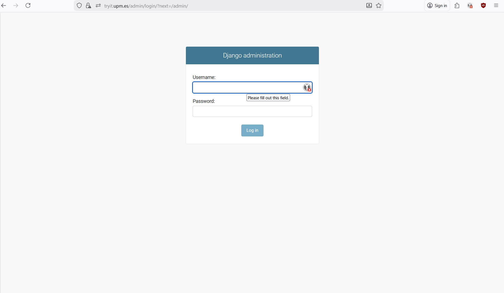 | 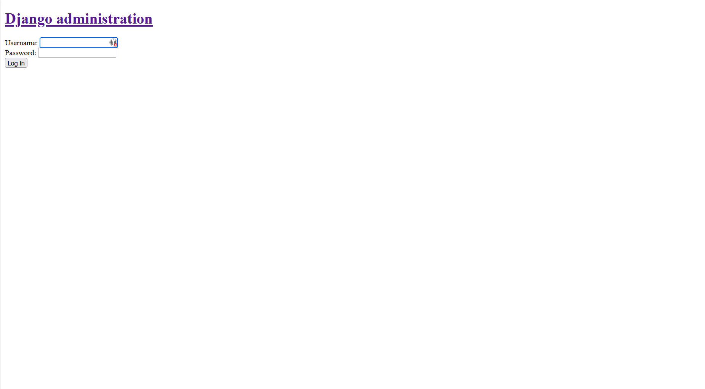 |
| 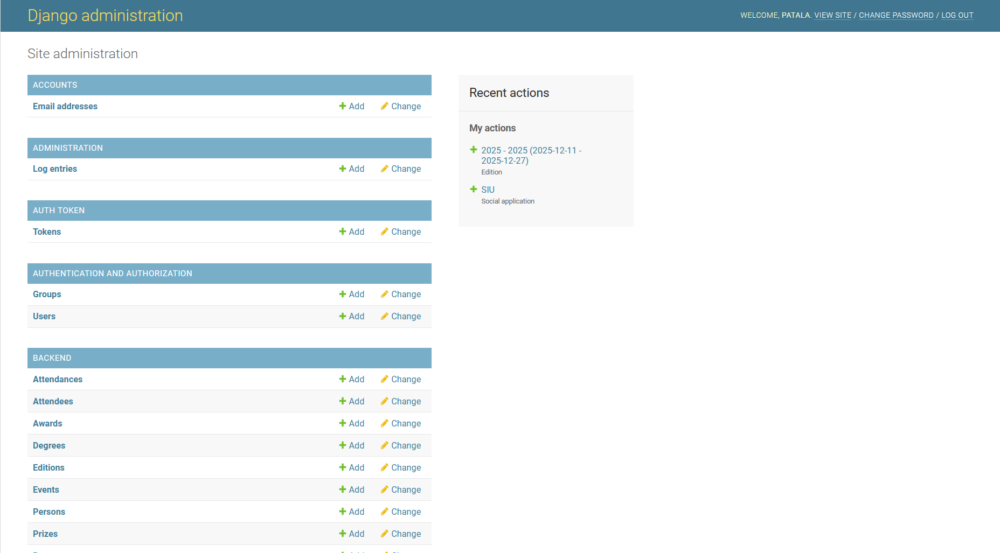 | 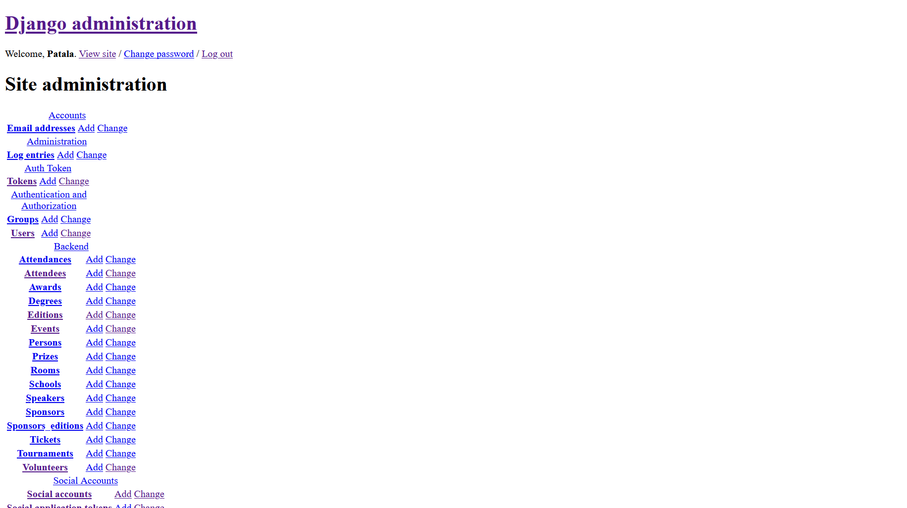 |

En el *docker-compose.yml*  hay una ruta a ficheros estáticos que puede necesitar edición según dónde hayas descargado el backend:

```yml
    volumes:
      - ../tryit-backend/tryit/static:/usr/share/nginx/static:ro
```

Actualmente está configurado asumiendo que tienes el backend y el sistema de ayuda clonados en la misma carpeta.

Cambia esa ruta para que apunte al repositorio del backend en tu sistema de ficheros.
</div>
<div style="margin-left: 1em;">

### 3.2 Ejecutar nginx 

</div>
<div style="margin-left: 2em;">

Este paso hace que tryit.upm.es no solo apunte a localhost, sinó que apunte a las partes del sistema del tryit. Así se conecta también el frontend y el backend.

Ejecuta el docker compose de este repositorio:

```bash
docker-compose up -d
```

>Disclaimer importante:
>
> Los puertos **80** y **443** deben estar **libres**.
</div>

## 4. Ejecutar el frontend

Desde la carpeta del frontend:

```bash
npm install
npm run dev
```

| |
|:-:|
|  |

<p align="center">
  
</p>

## 5. Ejecutar el backend
<div style="margin-left: 1em;">

### 5.1 Arrancar Docker Compose del backend
</div>
<div style="margin-left: 2em;">

```bash
docker-compose up -d
```
</div>
<div style="margin-left: 1em;">

### 5.2 Ejecutar scripts dentro del contenedor
</div>
<div style="margin-left: 2em;">

```bash
docker exec -it tryit-backend-web-1 python manage.py migrate
docker exec -it tryit-backend-web-1 python manage.py import_upm_schools
docker exec -it tryit-backend-web-1 python manage.py createsuperuser
```
Al final del ultimo comando vas a tener que intriducir datos para tu superusuario. Introduce el nombre de usuario y contraseña que prefieras. El correo se puede dejar en blanco.

Con este perfil accederás luego a la pagina de administrador del backend.

<div style="display: flex; justify-content: center; gap: 10px;">
  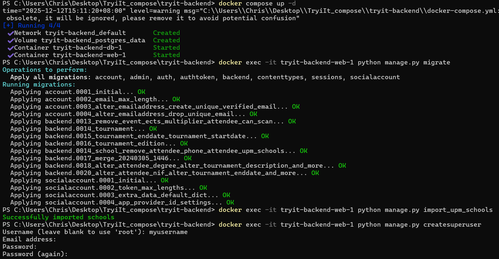
</div>
</div>

## 6. Añade datos del SIU en el panel de administración

Abre el navegador en:

https://tryit.upm.es/admin

Inicia sesión con el usuario creado en el paso anterior.

>Disclaimer: Si olvidas la contraseña, ejecuta de nuevo el comando createsuperuser del paso anterior para crear un nuevo usuario.


### Configurar Socialaplication
<div style="margin-left: 1em;">

Añade una instancia de Socialaplication con 
- Provider: Keylocak
- Provider ID: Keycloak
- nombre: SIU
- Client id: Llave proporcionada por el coordinador web
- Secret key: Otra llave proporcionada por el coordinador web
- Key: La Secret Key

<br>
<div style="display: flex; justify-content: center; gap: 10px;">
  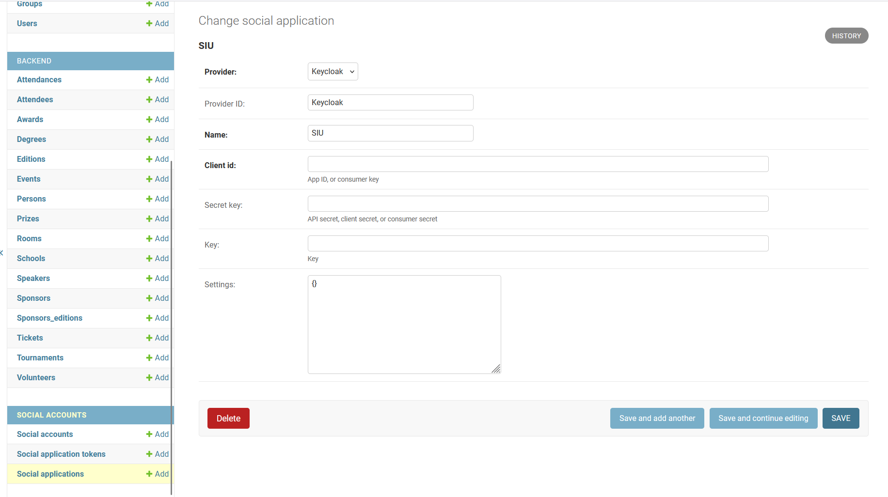
</div>
<br>
En la imagen falta el client id, secret key y key. Estos serán proporcionados por el coordinador web.
</div>

## 7. Añadir una edición con el año actual

Para que el frontend conecte correctamente con el backend tiene que haber una instancia de *Edition* para el año actual.

Si no existe ninguna edición para el año actual crea una. Para propositos de desarollo el único campo importante es
- Year: Año actual

> Si sigue habiendo un error a la hora de realizar peticiones entre el frontend y el backend revisa para que año está configurado el frontend.
> Eso se puede revisar en nuxt.config.ts del frontend:

```TypeScript
	env: {
		dev: process.env.NODE_ENV !== "production",
		//api: "https://api.congresotryit.es",
		api: "https://tryit.upm.es",
		edition: 2025
	},
```

<br>
<div style="display: flex; justify-content: center; gap: 10px;">
  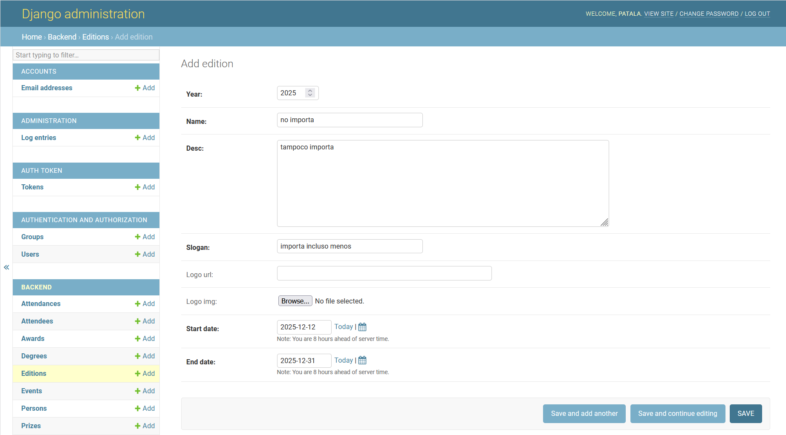
</div>

## 8. Listo

El sistema de desarrollo debería estar completamente funcional y accesible mediante https://tryit.upm.es.

A continuación se van a explicar varias pruebas que se pueden realizar para comprobar que se ha deployeado el sistema correctamente.

## 9. Pruebas

<div style="margin-left: 1em;">

### 9.1 Conexión backend frontend

<div style="margin-left: 1em;">

Revisa que el backend no mande un error al frontend cuando le pida información de la edición actual.

Para hacer eso entra en la pestaña de ***📅Horarios*** y mira si hay un error.

<div style="display: flex; justify-content: center; gap: 10px;">
  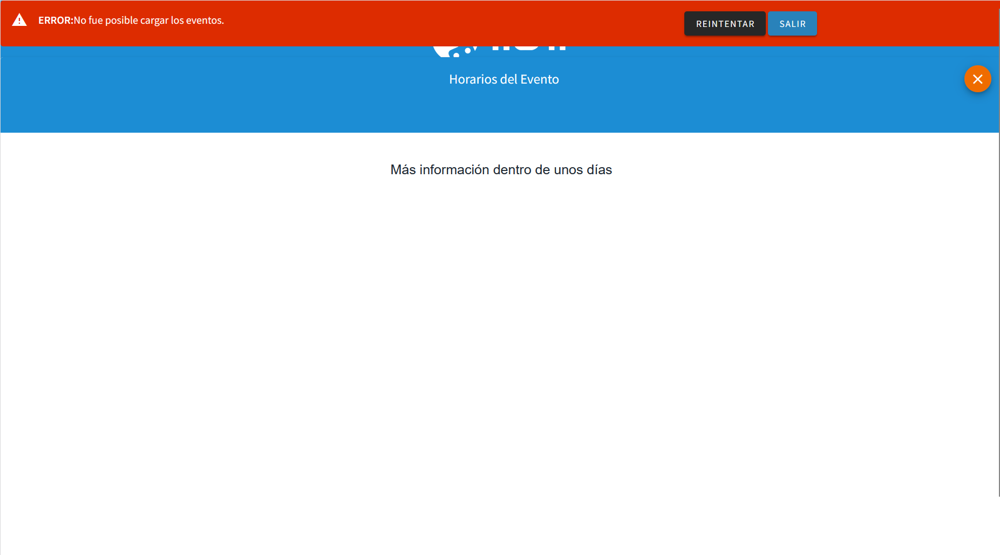
  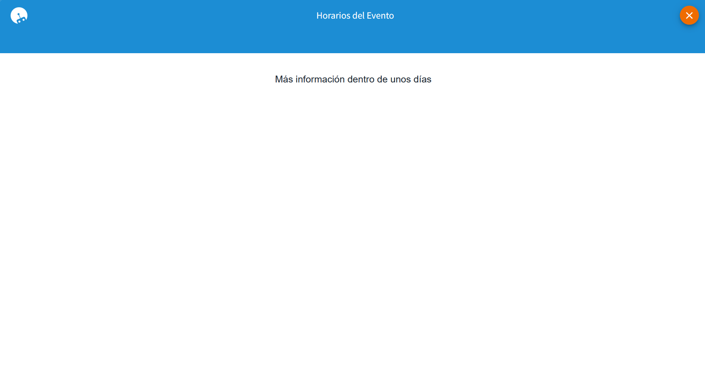
</div>
<br>

La primera imagen es lo que sale si hay un problema en la configuración. La segunda si está todo correctamente.

> **DISCLAIMER IMPORTANTE:** Si salta el error prueba realizar la prueba en **NAVEGACIÓN PRIVADA**. A veces se queda guardado en el navegador una mala configuración a pesar de que luego se haya creado la edición para el año actual.

Si sigue saliendo el error revisa el paso [Paso 7.](#7-añadir-una-edición-con-el-año-actual "Ir al paso 7")
Asegurate de que existe una edición para el año para el cual está configurado el frontend.

Si quieres revisar si existe abre la consola pulsando ```F12```, pulsa el botón de *Reintentar* y revisa en el apartado de red a que dirección está mandando la petición.

Copia esa dirección y ponla en otra pestaña del buscador. Si sale un error 404 es que no existe una edición para ese año. Si devuelve un 200 OK si existe una edición para ese año y el error es otro.


Primera imagen: pestaña de red para ver url de petición. Segunda imagen: API root tras pegar la dirección en un buscador. Devuelve 200 OK.
<div style="display: flex; justify-content: center; gap: 10px;">
  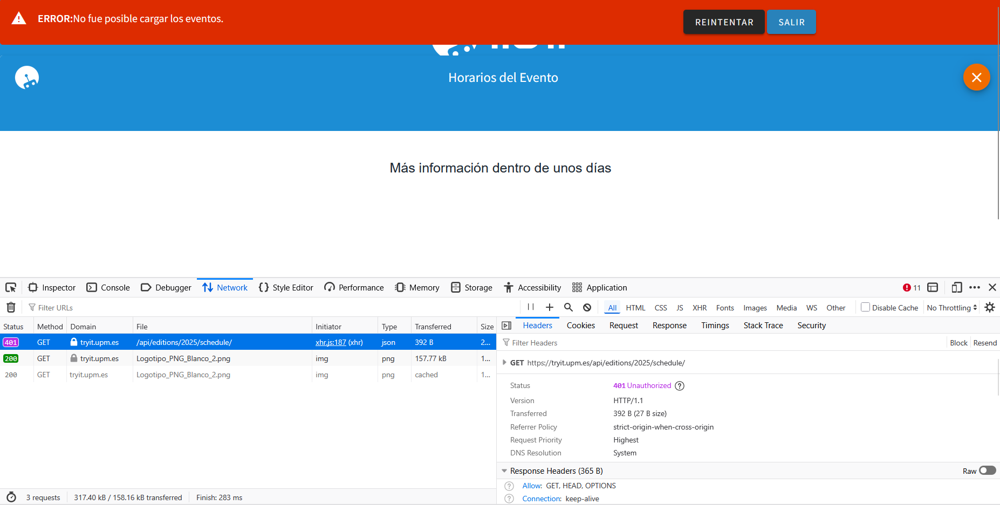
  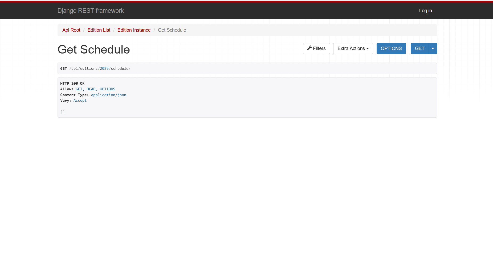
</div>
<br>

>Si salta un error en la pagina pero en la API root devuelve un 200 OK recuerda intentar acceder a la página en **navegación privada!**

</dev>


### 9.2 Login con SIU
<div style="margin-left: 1em;">

Para revisar que el SIU está correctamente configurado, y por lo tanto que podrás realizar pruebas con perfiles de verdad, haz la siguiente prueba.

Inicia sesión con el SIU. Para esto hay que hacer click en el apartado de *Iniciar Sesión* y seleccionar *Usuario UPM*. 

Esto te redirigirá al SIU de la UPM (la página con la que inicias sesión en Moodle). Pon tus datos e inicia sesión. Tus datos de inicio de sisión **NO** serán guardados en nuestro sistema, así que no hay que preocuparse de eso.

<div style="display: flex; justify-content: center; gap: 10px;">
  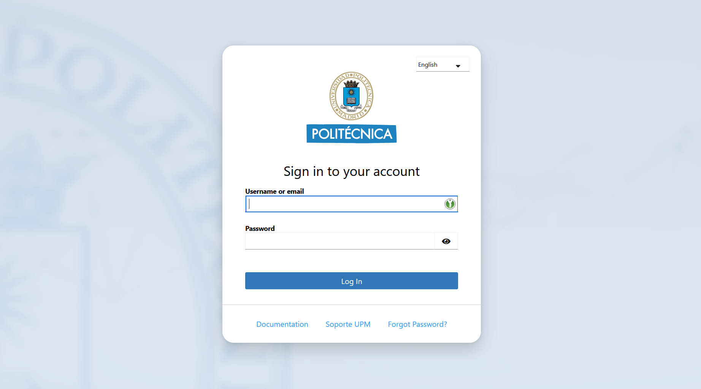
</div>
<br>

Después de eso te debería de redirigir a la homepage del tryit. En vez de *Iniciar sesión* el apartado se debería de llamar *Logout* y debería de haber aparecido un pequeño pop up naranja momentaneo si es la primera vez que inicias sesión y todavía no te has sacado entrada. 

Si no ha ocurrido esto, esta es una lista de errores que puede ocurrir:

#### 9.2.1 Botón de iniciar sesión no redirige al SIU, redirige a una página de error:
<div style="margin-left: 1em;">

Si cuando le das al botón de lógin no te redirigue a la página del SIU, sino que te redirige a una página de error como esta:

<div style="display: flex; justify-content: center; gap: 10px;">
  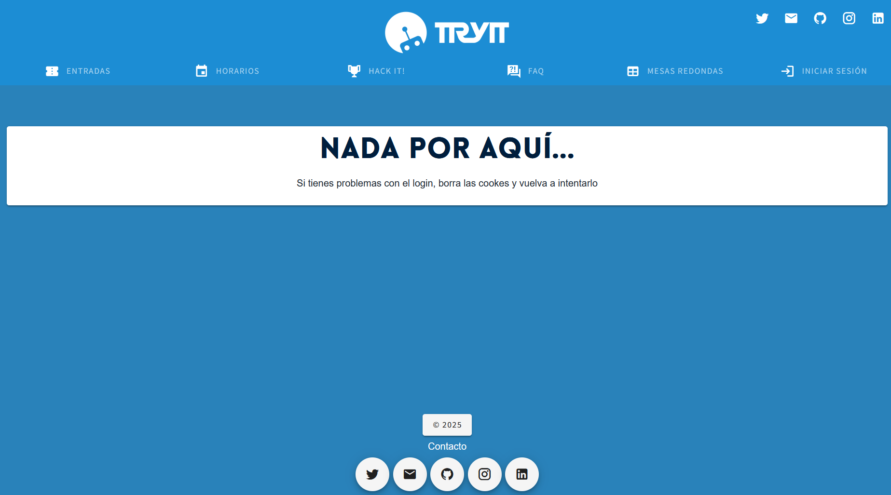
</div>
<br>

Entonces tienes una mala configuración del SIU. Vete a [La página de administración](https://tryit.upm.es/admin/socialaccount/socialapp/) y revisa que exista el SIU como especificado en el paso [Paso 6.](#6-añade-datos-del-siu-en-el-panel-de-administración "Ir al paso 6"). Si existe el SIU asegurate de que las claves/llaves sean correctas.

>**DISCLAIMER!:** Si te sale este error y crees que tienes la configuración bien recuerda realizar la prueba en **NAVEGACIÓN PRIVADA!**
</div>

#### 9.2.2 Tras iniciar sesión en el SIU redirige a una página de error:
<div style="margin-left: 1em;">

Si cuando le das al botón de login redirigue correctamente al SIU, pero trás iniciar sesión ahi te redirige a la página de error mostrada en el paso anterior en vez de a la homepage o una pagina de error blanca donde pone *Cannot GET /login*:

Prueba ejecutar la prueba en **navegación privada**. Si sigue fallando pide ayuda al coordinador web para asegurarte de que el entorno de desarollo se está ejecutando en ***target server*** y no ***target static***.

Revisa el paso [Paso 4.](#4-ejecutar-el-frontend "Ir al paso 4"). Asegurate que al ejecutar 
```bash
npm run dev
```
Saliera el texto
```
cross-env NUXT_MODE=server nuxt --hostname=0.0.0.0
```
al principió del proceso de construcción del frontend.

Si no sale asegurate que tienes la versión más nueva del frontend. Comprueba en ```package.json```, en la sección de *scripts*, que el texto anterior sea el comando de *dev*

```json
	"scripts": {
		"dev": "cross-env NUXT_MODE=server nuxt --hostname 0.0.0.0",
		"build": "nuxt build",
		"start": "nuxt start",
		"generate": "nuxt generate"
	},
```
</div>
</div>

### 9.3 tryit.upm.es apunta a localhost
<div style="margin-left: 1em;">

Se recomienda ejecutar esta prueba tras el paso [Paso 2.](#2-configuración-del-fichero-hosts "Ir al paso 2").

Para comprobar que se ha realizado exitosamente la generación del alias de tryit.upm.es a localhost abre una terminal **nueva** y ejecuta el siguiente comando:

```bash
ping tryit.upm.es
```

Debería de devolver lo siguiente:

```bash
PS C:\Users\YourUser> ping tryit.upm.es

Pinging tryit.upm.es [127.0.0.1] with 32 bytes of data:
Reply from 127.0.0.1: bytes=32 time<1ms TTL=128
Reply from 127.0.0.1: bytes=32 time<1ms TTL=128
Reply from 127.0.0.1: bytes=32 time<1ms TTL=128
Reply from 127.0.0.1: bytes=32 time<1ms TTL=128

Ping statistics for 127.0.0.1:
    Packets: Sent = 4, Received = 4, Lost = 0 (0% loss),
Approximate round trip times in milli-seconds:
    Minimum = 0ms, Maximum = 0ms, Average = 0ms
```

Es importante que ponga *Reply from **127.0.0.1*** y no otra IP.

Si pone otra dirección IP prueba ejecutar las siguienes instrucciones:

<div style="margin-left: 1em;">

#### Windows
<div style="margin-left: 1em;">

```bash
ipconfig /flushdns
```
</div>

#### Linux
<div style="margin-left: 1em;">
Depende de la distro y de si usa ```systemd-resolved``` o ```nscd```

```bash
sudo systemd-resolve --flush-caches
# or
sudo /etc/init.d/nscd restart
```
</div>

#### macOS
<div style="margin-left: 1em;">

```bash
sudo dscacheutil -flushcache
sudo killall -HUP mDNSResponder
```
</div>
</div>

Esto ocurre porque a veces el sistema cachea busquedas previas.

Si sigue ocurriendo el error asegurate de que has realizado bien el paso [Paso 2.](#2-configuración-del-fichero-hosts "Ir al paso 2") y que la linea del alias no está comentada.

</div>

### 9.4 tryit.upm.es o tryit.upm.es/admin o tryit.upm.es/api devuelven 502 Bad Gateway o un Unable to conect
<div style="margin-left: 1em;">

Si al intentar acceder a cualquier parte del sistema recibes un **Unable to conect** revisa que el contenedor nginx de este sistema de ayuda este ejecutando correctamente:
<div style="margin-left: 1em;">

Recuerda que para que pueda ejecutarse correctamente necesita que los puertos **80** y **443** estén libres en el momento de ejecutar el *docker compose up -d*.

Para revisar que el contenedor esté ejecutando puedes usar el siguiente comando:

```bash
docker ps -a
```

Este comando te enseña todos los contenedores que tienes levantados. Busca el contenedor de este sistema de ayuda (tendrá un nombre similar a setup-nginx-1) y mira su estado. Debería de ser ***Up***. Si es otra cosa (*Stopped* o *Exited*) prueba levantarlo sin la flag ``` -d ``` y con la flag ``` --build ```

```bash
docker compose up --build
```

y comprueba que error lanza. 

Si funciona después de esto usa ```Ctrl+C``` y vuelve a ejecutar 
```bash
 docker compose up -d 
```

<br>

</div>

Si al intentar acceder al frontend o a alguna parte del backend te devuelve un **502 Bad Gateway**:

<div style="margin-left: 1em;">

Comprueba que los sistemas estén corriendo.

En el navegador intenta acceder a http://localhost:8000 y http://localhost:8050 para comprobar la ejecución del backend y el frontend respectivamente.

Si alguno falla intenta levantarlo. Mira los pasos [Paso 4](#4-ejecutar-el-frontend) y [Paso 5](#5-ejecutar-el-backend). Para diagnosticar errores al levantar el backend usa los comandos del paso anterior.

</div>
</div>